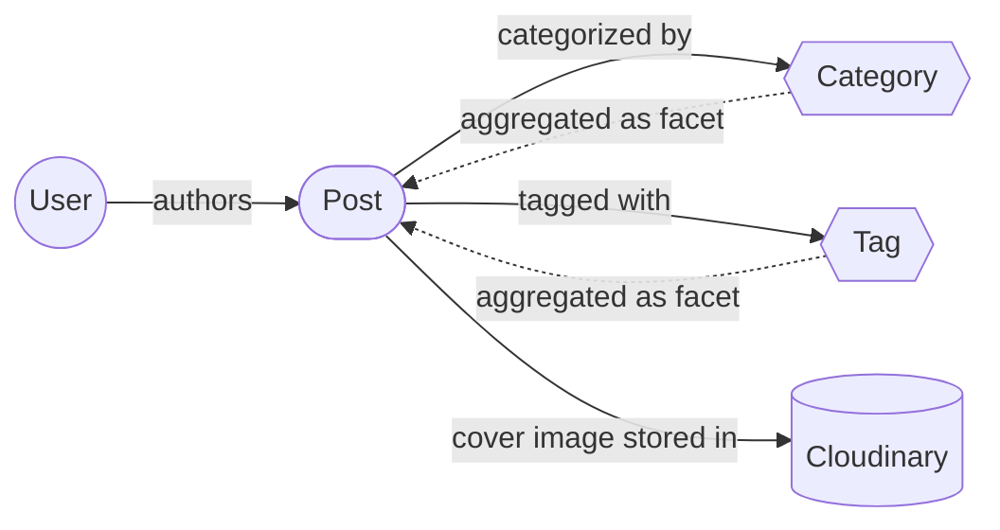
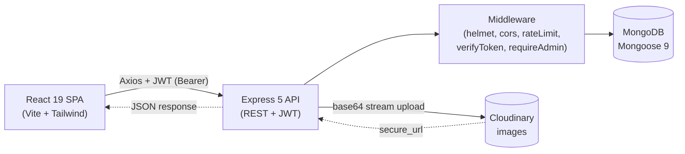

<div align="center">
  <p>
    <strong>📝 Simple Blog MERN</strong>
  </p>

  <h1>Simple Blog MERN</h1>

  <p><em>A full-stack blog application with JWT authentication, a role-based admin dashboard, Markdown-powered content, Cloudinary image uploads, and a security-hardened MERN architecture.</em></p>

  <p>
    
    
    
    
    
    
    
    
    
    
  </p>

  <p>
    <a href="https://simple-blog-mernn.netlify.app/">Live Demo</a> •
    <a href="#features">Features</a> •
    <a href="#installation">Quick Start</a> •
    <a href="#api-endpoints">API Docs</a> •
    <a href="#architecture">Architecture</a>
  </p>
</div>

---

## Features

- **Public Blog** — Browse posts, read full articles with rich Markdown rendering and syntax-highlighted code blocks
- **SEO-Friendly Slugs** — Auto-generated URL slugs from post titles for clean, shareable URLs
- **SEO Meta Tags** — Per-page `<title>`, description, and Open Graph tags via `react-helmet-async`
- **Markdown Support** — Full GFM (GitHub Flavored Markdown) with tables, task lists, blockquotes, and fenced code blocks
- **Dark Mode** — System-aware light/dark theme toggle persisted in `localStorage` via a theme context
- **Reading Time** — Auto-calculated reading time per post (≈238 words/min) shown in listings and detail view
- **Related Posts** — Suggested posts by shared category/tags on the post detail page
- **Share Buttons** — Quick social sharing (and copy-link) on each article
- **Admin Dashboard** — Create, edit, delete, and manage blog posts from a dedicated panel with table/card views
- **Cloudinary Image Uploads** — Upload cover images for posts via Multer + Cloudinary integration (JPEG, PNG, WebP — 5 MB limit)
- **Category & Tag System** — Organize posts with categories and tags; filter and search on the homepage
- **JWT Authentication** — Secure register and login system with token-based authentication (7-day expiry)
- **Role-Based Access** — Admin role auto-assigned via `ADMIN_EMAIL` environment variable; protected routes on both client and server
- **Debounced Search** — Real-time search with debounce for optimal performance and fewer API calls
- **Paginated Listing** — Load-more pagination for the post feed with query parameter support
- **Rate Limiting** — General API limiter (100 req/15 min) + stricter auth limiter (20 req/15 min)
- **Security Hardened** — Helmet, CORS whitelist, request size limits, bcrypt password hashing, request body & query type validation
- **Lazy Loading** — React.lazy + Suspense for optimized page loading with spinner fallback
- **Responsive UI** — Mobile-first design with Tailwind CSS 4
- **Reusable UI Kit** — Button, Input, Modal, Alert, Badge, Skeleton, Spinner, Toast components
- **Toast Notifications** — Auto-dismissing success, error, and info notifications via context
- **Custom 404 Page** — Friendly not-found page for unmatched routes
- **Scroll Helpers** — Scroll-to-top on route change and a floating back-to-top button
- **Health Check** — `/api/health` endpoint for uptime monitoring

---

## Live Demo

[🚀 View Live Demo](https://simple-blog-mernn.netlify.app/)

---

## Architecture

A high-level visual map of the system. Both diagrams render natively on GitHub thanks to Mermaid support.

### Domain Model

How the core data relates. `User` and `Post` are MongoDB collections; categories and tags are stored on each post and surfaced as filter facets through aggregation.



### Request Lifecycle

How a single browser action travels through the stack, from the SPA to the database.



---

## Technologies

### Frontend

- **React 19**: Modern UI library with hooks and context for state management
- **Vite 8**: Lightning-fast build tool and dev server with HMR
- **Tailwind CSS 4**: Utility-first CSS framework for rapid, responsive styling
- **React Router 7**: Declarative client-side routing with lazy-loaded pages
- **Axios 1**: Promise-based HTTP client with request/response interceptors
- **react-helmet-async 3**: Declarative document head management for SEO meta tags
- **react-markdown 10**: Markdown-to-React component renderer
- **remark-gfm 4**: GitHub Flavored Markdown plugin (tables, task lists, strikethrough)
- **react-syntax-highlighter 16**: Prism-based code block syntax highlighting with line numbers

### Backend

- **Node.js 18+**: Server-side JavaScript runtime
- **Express 5**: Minimal and flexible web application framework
- **MongoDB (Mongoose 9)**: NoSQL database with elegant object modeling and indexing
- **JSON Web Token 9**: Stateless authentication with signed token verification
- **bcryptjs 3**: Password hashing with 12 salt rounds
- **Multer 2**: Multipart form-data file upload handling (memory storage)
- **Cloudinary 2**: Cloud-based image storage and delivery
- **Helmet 8**: HTTP security headers with sensible defaults
- **express-rate-limit 8**: IP-based request rate limiting
- **compression 1**: Gzip response compression middleware
- **slugify 1**: URL-friendly slug generation from post titles
- **dotenv 17**: Environment variable management

---

## Installation

### Prerequisites

- **Node.js** v18+ and **npm** — [Download](https://nodejs.org/)
- **MongoDB** — [MongoDB Atlas](https://www.mongodb.com/atlas) (free tier) or local instance
- **Cloudinary** account — [Sign up](https://cloudinary.com/) (free tier available)

### Local Development

**1. Clone the repository:**

```bash
git clone https://github.com/serkanbyx/simple-blog-mern.git
cd simple-blog-mern
```

**2. Set up environment variables:**

```bash
cp server/.env.example server/.env
cp client/.env.example client/.env
```

**server/.env**

```env
PORT=5000
MONGO_URI=mongodb://localhost:27017/simple-blog
JWT_SECRET=replace_with_a_strong_random_string
ADMIN_EMAIL=admin@example.com
SEED_ADMIN_PASSWORD=replace_with_a_strong_admin_password
CLIENT_URL=http://localhost:5173
NODE_ENV=development
CLOUDINARY_CLOUD_NAME=your_cloud_name
CLOUDINARY_API_KEY=your_api_key
CLOUDINARY_API_SECRET=your_api_secret
```

| Variable | Description |
|---|---|
| `PORT` | Server port number |
| `MONGO_URI` | MongoDB connection string (Atlas or local) |
| `JWT_SECRET` | Secret key for signing JWT tokens |
| `ADMIN_EMAIL` | Email address that receives admin role on registration |
| `SEED_ADMIN_PASSWORD` | Password for the auto-created admin user during seeding |
| `CLIENT_URL` | Frontend URL for CORS whitelist |
| `NODE_ENV` | Environment mode (`development` or `production`) |
| `CLOUDINARY_CLOUD_NAME` | Cloudinary account cloud name |
| `CLOUDINARY_API_KEY` | Cloudinary API key |
| `CLOUDINARY_API_SECRET` | Cloudinary API secret |

**client/.env**

```env
VITE_API_URL=http://localhost:5000/api
```

| Variable | Description |
|---|---|
| `VITE_API_URL` | Backend API base URL with `/api` suffix |

**3. Install dependencies:**

```bash
cd server && npm install
cd ../client && npm install
```

**4. Seed the database (optional — creates an admin user and demo posts):**

```bash
cd server && node src/seed.js
```

**5. Run the application:**

```bash
# Terminal 1 — Backend
cd server && npm run dev

# Terminal 2 — Frontend
cd client && npm run dev
```

The client runs at `http://localhost:5173` and the API at `http://localhost:5000`.

---

## Usage

1. **Browse Posts** — Visit the homepage to see all published blog posts with cover images, categories, and tags
2. **Search & Filter** — Use the search bar or click on categories and tags to filter posts
3. **Read a Post** — Click any post card to view the full article with rich Markdown rendering
4. **Toggle Theme** — Switch between light and dark mode from the navigation bar
5. **Register** — Create a new account from the Register page
6. **Login** — Sign in with your credentials to access authenticated features
7. **Admin Access** — If your email matches `ADMIN_EMAIL`, you automatically get admin privileges
8. **Create Posts** — Navigate to the Admin Dashboard and create new blog posts with Markdown content and cover images
9. **Edit & Delete** — Manage existing posts from the Admin Dashboard with edit and delete actions
10. **Logout** — Sign out from the navigation bar

---

## How It Works?

### Authentication Flow

The application uses JWT-based stateless authentication. On register or login, the server generates a signed token (7-day expiry) containing the user's `id` and `role`. The client stores this token in `localStorage` and attaches it to every API request via an Axios request interceptor.

```javascript
// Axios request interceptor — auto-attaches Bearer token
api.interceptors.request.use((config) => {
  const token = localStorage.getItem("token");
  if (token) {
    config.headers.Authorization = `Bearer ${token}`;
  }
  return config;
});
```

On 401 responses, the Axios response interceptor clears the token and dispatches an `auth:expired` event, which the `AuthContext` listens for to auto-logout the user.

### Admin Role Assignment

Admin access is controlled via the `ADMIN_EMAIL` environment variable. When a user registers with an email matching `ADMIN_EMAIL`, the server automatically assigns the `admin` role to that account. Admin users can access the `/admin` dashboard and all CRUD operations on posts.

### Data Flow

1. **Client** sends requests to the Express API via Axios (base URL from `VITE_API_URL`)
2. **Express** validates the request through middleware (rate limiter → token verification → admin check)
3. **Controllers** process business logic, validate input types, and interact with **Mongoose models**
4. **MongoDB** stores and retrieves data (posts with slugs, categories, tags; users with hashed passwords)
5. **Cloudinary** handles image storage; upload URLs are saved in post documents
6. **Response** flows back through the centralized error handler middleware for consistent error formatting

### Markdown Rendering

Post content is written in Markdown and rendered on the client using `react-markdown` with the `remark-gfm` plugin. Custom components handle styled headings, responsive tables, syntax-highlighted code blocks (via Prism with the `oneDark` theme), and image rendering.

---

## API Endpoints

### Authentication

| Method | Endpoint | Auth | Description |
|---|---|---|---|
| `POST` | `/api/auth/register` | No | Register a new user |
| `POST` | `/api/auth/login` | No | Login and receive JWT |
| `GET` | `/api/auth/me` | Yes | Get current user profile |

### Posts

| Method | Endpoint | Auth | Description |
|---|---|---|---|
| `GET` | `/api/posts` | No | List all posts (pagination, search, category, tag filters) |
| `GET` | `/api/posts/filters` | No | Get available filter options (categories, tags) |
| `GET` | `/api/posts/:slug` | No | Get a single post by slug |
| `GET` | `/api/posts/id/:id` | Yes (Admin) | Get a single post by ID (admin editing) |
| `POST` | `/api/posts` | Yes (Admin) | Create a new post |
| `PUT` | `/api/posts/:id` | Yes (Admin) | Update a post |
| `DELETE` | `/api/posts/:id` | Yes (Admin) | Delete a post (also removes Cloudinary image) |

### Categories & Tags

| Method | Endpoint | Auth | Description |
|---|---|---|---|
| `GET` | `/api/categories` | No | List all categories with post counts |
| `GET` | `/api/categories/tags` | No | List all tags with post counts |

### Upload

| Method | Endpoint | Auth | Description |
|---|---|---|---|
| `POST` | `/api/upload` | Yes (Admin) | Upload an image (multipart `image` field, 5 MB max) |

### Utility

| Method | Endpoint | Auth | Description |
|---|---|---|---|
| `GET` | `/api/health` | No | Health check |

> **Rate Limits:** All `/api/*` routes are limited to **100 requests per 15 minutes** per IP. Auth routes (`/api/auth/*`) have a stricter limit of **20 requests per 15 minutes**.

> Auth endpoints require `Authorization: Bearer <token>` header.

---

## Project Structure

A clean monorepo layout with an explicit backend / frontend split. Each panel below is collapsible — expand the one you care about.

<details open>
<summary><b>Server</b> — Express 5 API</summary>

```
server/
├── src/
│   ├── config/          # cloudinary, db connection, multer upload
│   ├── controllers/     # auth, post, category handlers
│   ├── middlewares/     # verifyToken, requireAdmin, errorHandler
│   ├── models/          # Mongoose schemas (User, Post)
│   ├── routes/          # auth, post, category, upload routers
│   ├── utils/           # generateToken, escapeRegex, validateObjectId
│   ├── seed.js          # admin + demo posts seeding script
│   └── index.js         # Express app composition + server bootstrap
├── .env.example
└── package.json
```

</details>

<details>
<summary><b>Client</b> — React 19 + Vite SPA</summary>

```
client/
├── public/              # _redirects (Netlify SPA fallback)
├── src/
│   ├── api/             # Axios instance with interceptors
│   ├── components/      # UI kit, Navbar, Footer, PostCard, SEO, etc.
│   │   ├── admin/       # PostForm (create/edit)
│   │   └── ui/          # Button, Input, Modal, Alert, Badge, Toast…
│   ├── context/         # AuthContext, ThemeContext, ToastContext
│   ├── hooks/           # useDocumentTitle
│   ├── layouts/         # MainLayout (Navbar + Footer)
│   ├── pages/           # Home, PostDetail, Login, Register, Admin…
│   ├── utils/           # markdownComponents, readingTime
│   ├── App.jsx          # routes + lazy loading
│   └── main.jsx         # entry point (provider tree)
├── netlify.toml
├── vite.config.js
└── package.json
```

</details>

<details>
<summary><b>Repository root</b> — docs & governance</summary>

```
simple-blog-mern/
├── client/              # → see Client panel above
├── server/              # → see Server panel above
├── .github/             # issue templates, PR template, governance docs
│   ├── ISSUE_TEMPLATE/  # bug_report.yml, feature_request.yml, config.yml
│   ├── CODE_OF_CONDUCT.md
│   ├── CONTRIBUTING.md
│   ├── SECURITY.md
│   └── PULL_REQUEST_TEMPLATE.md
├── LICENSE
└── README.md
```

</details>

---

## Security

- **HTTP Security Headers** — Helmet.js applies sensible security headers (X-Content-Type-Options, X-Frame-Options, CSP, etc.)
- **CORS Whitelist** — Only requests from `CLIENT_URL` origin are accepted; credentials enabled
- **Rate Limiting** — General limiter (100 req/15 min) + auth-specific limiter (20 req/15 min) per IP address
- **Password Hashing** — bcryptjs with 12 salt rounds; passwords are never stored in plain text
- **JWT Authentication** — Signed tokens with secret key verification; 7-day expiry; `select: false` on password field
- **Role-Based Authorization** — `requireAdmin` middleware blocks non-admin users from sensitive operations
- **Request Size Limiting** — JSON and URL-encoded bodies capped at 10 KB to prevent payload attacks
- **Input Validation** — Server-side validation on all endpoints (username regex, email format, required fields)
- **Type-Safe Query & Body Handling** — Query params and request body fields are coerced/checked to be strings, preventing NoSQL operator injection (e.g. `?category[$gt]=`) and unexpected types reaching MongoDB
- **ReDoS-Safe Search** — User search input is escaped before being used in MongoDB `$regex` queries
- **File Upload Validation** — Only JPEG, PNG, and WebP accepted; 5 MB size limit via Multer
- **Response Compression** — Gzip compression via compression middleware for reduced bandwidth
- **Auto Session Expiry** — Client-side interceptor detects 401 responses and auto-logs out the user
- **Centralized Error Handling** — Consistent error responses with ValidationError, CastError, duplicate key, and JWT error handling

---

## Deployment

### Backend — Render

1. Create a new **Web Service** on [Render](https://render.com)
2. Connect your GitHub repository
3. Configure build settings:
   - **Root Directory:** `server`
   - **Build Command:** `npm install`
   - **Start Command:** `npm start`
4. Add environment variables in the Render dashboard:

| Variable | Value |
|---|---|
| `PORT` | `5000` |
| `MONGO_URI` | Your MongoDB Atlas connection string |
| `JWT_SECRET` | A strong random string |
| `ADMIN_EMAIL` | Your admin email address |
| `SEED_ADMIN_PASSWORD` | A strong password for the seed admin user |
| `CLIENT_URL` | Your Netlify URL (e.g., `https://simple-blog-mernn.netlify.app`) |
| `NODE_ENV` | `production` |
| `CLOUDINARY_CLOUD_NAME` | Your Cloudinary cloud name |
| `CLOUDINARY_API_KEY` | Your Cloudinary API key |
| `CLOUDINARY_API_SECRET` | Your Cloudinary API secret |

5. Deploy

### Frontend — Netlify

1. Create a new site on [Netlify](https://www.netlify.com)
2. Connect your GitHub repository
3. Configure build settings:
   - **Base Directory:** `client`
   - **Build Command:** `npm run build`
   - **Publish Directory:** `client/dist`
4. Add environment variable:

| Variable | Value |
|---|---|
| `VITE_API_URL` | Your Render backend URL with `/api` suffix (e.g., `https://your-api.onrender.com/api`) |

5. The `netlify.toml` and `public/_redirects` files are already configured for SPA routing
6. Deploy

> **Important:** After deploying the backend, update the `CLIENT_URL` env var on Render to match your Netlify URL, and update `VITE_API_URL` on Netlify to match your Render URL.

---

## Features in Detail

**Completed Features:**

- ✅ JWT authentication with register, login, and auto-logout
- ✅ Admin dashboard with post CRUD operations
- ✅ Markdown editor with live preview
- ✅ Cloudinary image upload integration
- ✅ Category and tag filtering with counts
- ✅ Debounced search with URL query parameters
- ✅ Load-more pagination
- ✅ Dark mode with persisted preference
- ✅ SEO meta tags and reading time
- ✅ Related posts and social share buttons
- ✅ Responsive mobile-first design
- ✅ Reusable UI component library
- ✅ Toast notification system
- ✅ Lazy-loaded pages with Suspense
- ✅ Centralized error handling and request type validation
- ✅ Rate limiting and security middleware
- ✅ SEO-friendly slug generation

**Future Features:**

- 🔮 [ ] Comment system with nested replies
- 🔮 [ ] Like / bookmark posts
- 🔮 [ ] User profile pages
- 🔮 [ ] RSS feed generation
- 🔮 [ ] Post view count analytics
- 🔮 [ ] Email notification on new posts

---

## Contributing

Contributions are welcome! Follow these steps:

1. **Fork** the repository
2. **Create** a feature branch: `git checkout -b feat/amazing-feature`
3. **Commit** your changes with a descriptive message
4. **Push** to the branch: `git push origin feat/amazing-feature`
5. **Open** a Pull Request

### Commit Message Format

| Prefix | Description |
|---|---|
| `feat:` | New feature |
| `fix:` | Bug fix |
| `refactor:` | Code refactoring |
| `docs:` | Documentation changes |
| `chore:` | Maintenance and dependency updates |

Please read our [Contributing Guide](.github/CONTRIBUTING.md) and [Code of Conduct](.github/CODE_OF_CONDUCT.md) before submitting a pull request.

---

## License

This project is licensed under the [MIT License](LICENSE).

---

## Developer

**Serkanby**

- Website: [serkanbayraktar.com](https://serkanbayraktar.com/)
- GitHub: [@Serkanbyx](https://github.com/Serkanbyx)
- Email: [serkanbyx1@gmail.com](mailto:serkanbyx1@gmail.com)

---

## Acknowledgments

- [React](https://react.dev/) — UI library
- [Vite](https://vite.dev/) — Build tool
- [Tailwind CSS](https://tailwindcss.com/) — CSS framework
- [Express](https://expressjs.com/) — Web framework
- [MongoDB](https://www.mongodb.com/) — Database
- [Cloudinary](https://cloudinary.com/) — Image hosting
- [react-markdown](https://github.com/remarkjs/react-markdown) — Markdown rendering
- [react-syntax-highlighter](https://github.com/react-syntax-highlighter/react-syntax-highlighter) — Code highlighting

---

## Contact

- [Open an Issue](https://github.com/serkanbyx/simple-blog-mern/issues)
- Email: [serkanbyx1@gmail.com](mailto:serkanbyx1@gmail.com)
- Website: [serkanbayraktar.com](https://serkanbayraktar.com/)

---

⭐ If you like this project, don't forget to give it a star!
