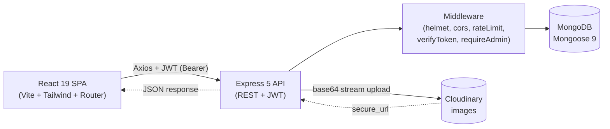

# Simple Blog MERN — Step-by-Step Build Guide

> **Archived: original build playbook.** This document is the original roadmap used to build Simple Blog MERN from an empty folder to a deployed full-stack application. It is intentionally self-contained: each step is written as a prompt you can execute in order. The codebase may have evolved since this guide was written, so for the current setup, architecture, and deployment notes always defer to [../README.md](../README.md).

---

> **Project Summary:** Simple Blog MERN is a full-stack blogging platform. Anonymous visitors can browse, search, filter, and read Markdown-rendered articles with syntax-highlighted code blocks, reading-time estimates, related posts, and social share links. A single admin role (auto-assigned by email) manages posts through a dedicated dashboard with full CRUD and Cloudinary cover-image uploads. Authentication is JWT-based and stateless; the API is hardened with Helmet, a CORS whitelist, two-tier rate limiting, bcrypt password hashing, request body/query type validation, and a centralized error handler. The frontend is a responsive React 19 SPA with dark mode, lazy-loaded routes, a reusable UI kit, toast notifications, and SEO meta tags.

Each step below is a self-contained prompt. Execute them in order.

Stack: MongoDB (Mongoose 9), Express 5, React 19, Node.js 18+, Vite 8, Tailwind CSS 4, JWT, bcryptjs, Multer, Cloudinary, Helmet, express-rate-limit, react-markdown, react-helmet-async.

---

## Table of Contents

**PHASE 1 — Backend Foundation**

- STEP 1 — Project Scaffolding & Dependency Setup
- STEP 2 — Environment Config, Database & Server Bootstrap
- STEP 3 — Security Middleware Stack & Global Rate Limiting
- STEP 4 — User Model, JWT Utilities & Auth Middleware
- STEP 5 — Authentication Controller & Routes

**PHASE 2 — Backend Resources**

- STEP 6 — Post Model with Slug, Excerpt & Reading Time
- STEP 7 — Post Controller (CRUD, Pagination, Filters)
- STEP 8 — Category & Tag Aggregation
- STEP 9 — Cloudinary Image Upload (Multer)
- STEP 10 — Centralized Error Handler & Database Seeding

**PHASE 3 — Client Foundation**

- STEP 11 — Client Scaffolding, Vite & Tailwind Setup
- STEP 12 — Axios Instance & Interceptors
- STEP 13 — Context Providers (Auth, Theme, Toast)
- STEP 14 — Routing, Layout & Protected Routes
- STEP 15 — Reusable UI Kit

**PHASE 4 — Client Pages**

- STEP 16 — Home Page (List, Search, Filter, Pagination)
- STEP 17 — Post Detail Page (Markdown, Related, Share)
- STEP 18 — Login & Register Pages
- STEP 19 — Admin Dashboard & Post Form (Create/Edit)
- STEP 20 — Not-Found Page

**PHASE 5 — Polish & Deploy**

- STEP 21 — SEO, Dark Mode & Scroll Helpers
- STEP 22 — Performance: Lazy Loading & Compression
- STEP 23 — Security Review & Hardening Pass
- STEP 24 — Deployment (Render + Netlify)

**Appendices**

- Appendix A — Shared Constants
- Appendix B — Common Pitfalls
- Appendix C — Pre-flight Checklist

---

## Global Build Rules (apply to EVERY step)

- **No git operations.** Do not run `git init`, `git add`, `git commit`, `git push`, or any other git command. Version control is handled manually by the user.
- **Do not install unapproved packages.** Only install the dependencies listed in a step. Prefer native methods over new dependencies.
- **Do not run long-running processes** (dev servers, watchers) unless the step explicitly requires it.
- **Treat every step as self-contained.** Re-read the relevant files before editing; do not assume prior in-memory state.
- **Keep code modern and clean:** ES6+, async/await, React Hooks, descriptive `camelCase` names, DRY, reusable modules.
- **Security, performance, and accessibility are always priorities**, not afterthoughts.
- **Never commit secrets.** All sensitive values live in `.env` files that are git-ignored; commit only `.env.example` templates with placeholders.
- Run lint/diagnostics on edited files at the end of each phase and fix introduced errors.

---

## Architecture at a Glance

A single Express API serves a React SPA. MongoDB stores users and posts; Cloudinary stores cover images. Authentication is a JWT bearer token attached by an Axios interceptor.



- **Client** (`client/`): React 19 + Vite 8 SPA, Tailwind 4, React Router 7, context-based state, lazy-loaded pages.
- **Server** (`server/`): Express 5 REST API, layered as `config → routes → middlewares → controllers → models`.
- **Database**: MongoDB via Mongoose 9; `User` and `Post` collections; categories/tags are post fields surfaced via aggregation.
- **Storage**: Cloudinary for cover images, uploaded through Multer memory storage.

---

# PHASE 1 — BACKEND FOUNDATION

---

## STEP 1 — Project Scaffolding & Dependency Setup

**Goal:** Create the monorepo layout and install backend dependencies.

**Files/folders to create:**

```
simple-blog-mern/
├── server/
│   └── src/
│       ├── config/
│       ├── controllers/
│       ├── middlewares/
│       ├── models/
│       ├── routes/
│       └── utils/
├── .gitignore
└── README.md
```

**Dependencies (in `server/`):**

```bash
npm init -y
npm install express mongoose dotenv cors helmet express-rate-limit compression jsonwebtoken bcryptjs multer cloudinary slugify
npm install -D nodemon
```

**Implementation notes:**

- Set `"type": "commonjs"` in `server/package.json`.
- Add scripts: `"dev": "nodemon src/index.js"` and `"start": "node src/index.js"`.
- Root `.gitignore` must include: `node_modules/`, `.env`, `.env.local`, `.env.production`, `dist/`, `*.log`, `.DS_Store`, `.vscode/`.

**Acceptance:** `npm run dev` starts (even if it errors on a missing DB) and the folder tree exists.

---

## STEP 2 — Environment Config, Database & Server Bootstrap

**Goal:** Wire up environment variables, the MongoDB connection, and the Express app entry point.

**Files to create:**

- `server/.env.example` — template with placeholders (never real secrets):

```env
PORT=5000
MONGO_URI=mongodb://localhost:27017/simple-blog
JWT_SECRET=replace_with_a_strong_random_string
ADMIN_EMAIL=admin@example.com
SEED_ADMIN_PASSWORD=replace_with_a_strong_admin_password
CLIENT_URL=http://localhost:5173
NODE_ENV=development
CLOUDINARY_CLOUD_NAME=your_cloud_name
CLOUDINARY_API_KEY=your_api_key
CLOUDINARY_API_SECRET=your_api_secret
```

- `server/src/config/db.js` — `connectDB()` that awaits `mongoose.connect(process.env.MONGO_URI)`, logs success, and `process.exit(1)` on failure.
- `server/src/index.js` — load `dotenv`, create the Express app, and start listening only after `connectDB()` resolves.

**Implementation notes:**

- Call `app.set('trust proxy', 1)` so rate limiting works behind a proxy (Render).
- Add a `GET /` welcome route and a `GET /api/health` route returning `{ status: 'ok', timestamp: Date.now() }`.

**Acceptance:** Server boots, connects to MongoDB, and `/api/health` returns 200.

---

## STEP 3 — Security Middleware Stack & Global Rate Limiting

**Goal:** Harden the API surface before any business logic ships.

**Files to edit:** `server/src/index.js`

**Implementation notes (order matters):**

```javascript
app.use(helmet());
app.use(cors({ origin: process.env.CLIENT_URL, credentials: true }));
app.use(express.json({ limit: '10kb' }));
app.use(express.urlencoded({ extended: true, limit: '10kb' }));
app.use(compression());

const apiLimiter = rateLimit({
  windowMs: 15 * 60 * 1000,
  max: 100,
  standardHeaders: true,
  legacyHeaders: false,
  message: { message: 'Too many requests. Please try again later.' },
});
app.use('/api', apiLimiter);
```

**Security expectations:** request bodies capped at 10 KB; only `CLIENT_URL` origin allowed; 100 requests/15 min per IP across `/api/*`.

**Acceptance:** Security headers appear in responses; exceeding the limit returns 429.

---

## STEP 4 — User Model, JWT Utilities & Auth Middleware

**Goal:** Define users with hashed passwords and the JWT verification/authorization layer.

**Files to create:**

- `server/src/models/User.js` — schema with `username` (unique, 3–30), `email` (unique, lowercased, regex), `password` (`select: false`, min 6), `role` (`enum: ['user','admin']`, default `user`), `createdAt`. Add a `pre('save')` hook that bcrypt-hashes the password (12 salt rounds) only when modified, and a `comparePassword(candidate)` method.
- `server/src/utils/generateToken.js` — `jwt.sign({ id, role }, JWT_SECRET, { expiresIn: '7d' })`.
- `server/src/middlewares/verifyToken.js` — read `Authorization: Bearer <token>`, verify, attach `req.user = { id, role }`, else 401.
- `server/src/middlewares/requireAdmin.js` — 403 unless `req.user.role === 'admin'`.

**Security expectations:** passwords never returned by default (`select: false`); tokens carry minimal claims (`id`, `role`).

**Acceptance:** A user document persists with a hashed password; an invalid token yields 401.

---

## STEP 5 — Authentication Controller & Routes

**Goal:** Implement register, login, and current-user endpoints.

**Files to create:**

- `server/src/controllers/authController.js` — `register`, `login`, `getMe`.
- `server/src/routes/authRoutes.js` — wire routes with a stricter auth rate limiter.

**Implementation notes:**

- Validate input **types** before use: `typeof username === 'string'` and a username regex (`^[a-zA-Z0-9]{3,30}$`), email regex, password length ≥ 6.
- Normalize email to lowercase; reject duplicates with 409.
- Assign `role = (normalizedEmail === process.env.ADMIN_EMAIL) ? 'admin' : 'user'`.
- On success, return `{ user: { id, username, email, role }, token }`.
- Auth limiter: `windowMs: 15 * 60 * 1000`, `max: 20`.
- Routes: `POST /register` (limiter), `POST /login` (limiter), `GET /me` (verifyToken).
- Mount in `index.js`: `app.use('/api/auth', authRoutes)`.

**Acceptance:** Register → login → `/me` round-trip works with a valid token.

---

# PHASE 2 — BACKEND RESOURCES

---

## STEP 6 — Post Model with Slug, Excerpt & Reading Time

**Goal:** Define the post schema with auto-derived fields.

**Files to create:** `server/src/models/Post.js`

**Implementation notes:**

- Fields: `title` (required, ≤200), `slug` (unique, indexed), `content` (required), `excerpt` (≤300), `image` (default `''`), `category` (required, ≤50), `tags` (array of strings ≤30), `readingTime` (default 1), `author` (ObjectId ref `User`, required), `createdAt`, `updatedAt`.
- `pre('validate')` hook:
  - Generate `slug` from `title` via `slugify(title, { lower: true, strict: true })` when title changes and a `_skipSlugGeneration` flag is not set.
  - Build `excerpt` from a Markdown-stripped version of `content` (truncate at 160 chars + `...`).
  - Compute `readingTime = Math.max(1, Math.ceil(wordCount / 238))`.
  - Bump `updatedAt` when not new.
- Add indexes on `createdAt: -1` and `category: 1`.

**Acceptance:** Creating a post auto-populates `slug`, `excerpt`, and `readingTime`.

---

## STEP 7 — Post Controller (CRUD, Pagination, Filters)

**Goal:** Full post lifecycle with safe querying.

**Files to create:**

- `server/src/controllers/postController.js`
- `server/src/routes/postRoutes.js`
- `server/src/utils/escapeRegex.js` — escape regex metacharacters to prevent ReDoS.

**Implementation notes:**

- `getAllPosts` — page/limit (defaults 1/6, max 20), filters by `category`, `tag`, and `search`. **Coerce query params to strings** (`typeof === 'string'`) before use to block NoSQL operator injection like `?category[$gt]=`. Use `escapeRegex` on `search` for the `title` `$regex`. Exclude `content` via `.select('-content')`, populate `author` username, sort newest first, return `{ posts, currentPage, totalPages, totalPosts }`.
- `getPostBySlug` — validate slug format with a regex before querying.
- `getPostById` — admin-only fetch by ObjectId (validate with `mongoose.Types.ObjectId.isValid`).
- `createPost` / `updatePost` — validate field **types**; sanitize `tags` (strings only, trimmed, max 10). On slug duplicate (`11000`) in create, retry once with a random `crypto` suffix and `_skipSlugGeneration = true`.
- `deletePost` — remove the doc and best-effort `cloudinary.uploader.destroy` for Cloudinary images.
- `getFilterOptions` — distinct `category` and `tags`, sorted.
- All handlers use `try/catch` and forward errors via `next(error)` to the centralized handler.
- Routes (order matters — static before `:slug`):

```javascript
router.get('/', getAllPosts);
router.get('/filters', getFilterOptions);
router.get('/id/:id', verifyToken, requireAdmin, getPostById);
router.get('/:slug', getPostBySlug);
router.post('/', verifyToken, requireAdmin, createPost);
router.put('/:id', verifyToken, requireAdmin, updatePost);
router.delete('/:id', verifyToken, requireAdmin, deletePost);
```

**Acceptance:** Listing, filtering, search, and admin CRUD all behave; malformed query types do not crash the server.

---

## STEP 8 — Category & Tag Aggregation

**Goal:** Expose categories and tags with post counts for filter UIs.

**Files to create:**

- `server/src/controllers/categoryController.js` — `getCategories` (`$group` by `category`) and `getTags` (`$unwind` tags, then `$group`), each projected to `{ name, count }` sorted by count.
- `server/src/routes/categoryRoutes.js` — `GET /` and `GET /tags`.

**Implementation notes:** Use `next(error)` for failures. Mount at `app.use('/api/categories', categoryRoutes)`.

**Acceptance:** `/api/categories` and `/api/categories/tags` return counted facets.

---

## STEP 9 — Cloudinary Image Upload (Multer)

**Goal:** Admin-only cover-image uploads.

**Files to create:**

- `server/src/config/cloudinary.js` — configure the SDK from env vars.
- `server/src/config/multer.js` — memory storage, `fileFilter` allowing only `image/jpeg|png|webp`, `limits.fileSize = 5 MB`.
- `server/src/routes/uploadRoutes.js` — `POST /` (verifyToken + requireAdmin) that runs `upload.single('image')`, converts the buffer to a base64 data URI, uploads to the `simple-blog` folder, and returns `{ url: result.secure_url }`. Handle `MulterError` (e.g. `LIMIT_FILE_SIZE`) explicitly.

**Implementation notes:** Mount at `app.use('/api/upload', uploadRoutes)`.

**Acceptance:** Posting a valid image returns a Cloudinary `secure_url`; oversized/invalid files return 400.

---

## STEP 10 — Centralized Error Handler & Database Seeding

**Goal:** Consistent error responses and a one-command demo dataset.

**Files to create:**

- `server/src/middlewares/errorHandler.js` — map `ValidationError` (400 + field messages), `CastError` (400), duplicate key `11000` (409), JWT errors (401), `MulterError`/file-type rejections (400), and a default 500. In development, include `stack`. Register **last**: `app.use(errorHandler)`.
- `server/src/seed.js` — connect to MongoDB, create a seed admin (from `ADMIN_EMAIL` + `SEED_ADMIN_PASSWORD`) if none exists, then insert demo posts idempotently (skip existing titles).

**Security expectations:** never leak stack traces in production; seeding aborts if `SEED_ADMIN_PASSWORD` is missing.

**Acceptance:** Errors return uniform JSON; `node src/seed.js` populates an admin and posts.

---

# PHASE 3 — CLIENT FOUNDATION

---

## STEP 11 — Client Scaffolding, Vite & Tailwind Setup

**Goal:** Bootstrap the React 19 SPA.

**Dependencies (in `client/`):**

```bash
npm create vite@latest client -- --template react
npm install react-router-dom axios react-helmet-async react-markdown remark-gfm react-syntax-highlighter
npm install @tailwindcss/vite tailwindcss
```

**Files to create/edit:**

- `client/vite.config.js` — add the React plugin and the Tailwind plugin.
- `client/src/index.css` — `@import "tailwindcss";` plus base theme variables for light/dark.
- `client/.env.example` — `VITE_API_URL=http://localhost:5000/api`.
- `client/public/_redirects` — `/*  /index.html  200` for SPA routing; add `netlify.toml`.

**Acceptance:** `npm run dev` serves a Tailwind-styled page at `http://localhost:5173`.

---

## STEP 12 — Axios Instance & Interceptors

**Goal:** A single configured HTTP client.

**Files to create:** `client/src/api/axios.js`

**Implementation notes:**

- `axios.create({ baseURL: import.meta.env.VITE_API_URL })`.
- Request interceptor: attach `Authorization: Bearer <token>` from `localStorage`.
- Response interceptor: on 401, clear the token and `window.dispatchEvent(new Event('auth:expired'))`.

**Acceptance:** Authenticated requests carry the token; expired sessions broadcast a logout event.

---

## STEP 13 — Context Providers (Auth, Theme, Toast)

**Goal:** App-wide state without prop drilling.

**Files to create:**

- `client/src/context/AuthContext.jsx` — holds `user`, `token`, `loading`; validates the token on mount via `/auth/me`; exposes `login`, `register`, `logout`, `isAdmin`; listens for `auth:expired` to force logout. Memoize the context value.
- `client/src/context/ThemeContext.jsx` — light/dark toggle persisted in `localStorage`, respecting system preference on first load; toggles a class on `<html>`.
- `client/src/context/ToastContext.jsx` — queue of auto-dismissing toasts with `success`/`error`/`info` helpers.

**Accessibility:** theme toggle is keyboard-operable and labeled; toasts use polite live regions.

**Acceptance:** Refreshing keeps the session and theme; toasts appear and auto-dismiss.

---

## STEP 14 — Routing, Layout & Protected Routes

**Goal:** Compose the router and the provider tree.

**Files to create/edit:**

- `client/src/main.jsx` — wrap `<App />` in `HelmetProvider → BrowserRouter → ThemeProvider → ToastProvider → AuthProvider`.
- `client/src/layouts/MainLayout.jsx` — `Navbar` + `<Outlet />` + `Footer`, plus `ScrollToTop` and `BackToTop`.
- `client/src/components/ProtectedRoute.jsx` — redirect unauthenticated/non-admin users; respect `AuthContext.loading`.
- `client/src/App.jsx` — declare routes; lazy-load every page with `Suspense`.

**Acceptance:** Public routes render; `/admin*` routes redirect non-admins to login.

---

## STEP 15 — Reusable UI Kit

**Goal:** Consistent, accessible building blocks (DRY).

**Files to create:** `client/src/components/ui/` — `Button.jsx`, `Input.jsx`, `Modal.jsx`, `Alert.jsx`, `Badge.jsx`, `Skeleton.jsx`, `Spinner.jsx`, `ToastContainer.jsx`, and a barrel `index.js`.

**Implementation notes:** variant/size props, focus-visible rings, `aria-*` attributes, dark-mode-aware classes. `Modal` traps focus and closes on `Escape`/backdrop click.

**Acceptance:** Components render across themes and are keyboard-navigable.

---

# PHASE 4 — CLIENT PAGES

---

## STEP 16 — Home Page (List, Search, Filter, Pagination)

**Goal:** The public blog feed.

**Files to create:** `client/src/pages/HomePage.jsx`, `client/src/components/PostCard.jsx`.

**Implementation notes:**

- Fetch `/posts` with `page`, `search`, `category`, `tag` query params; sync filters to the URL.
- Debounce the search input (~300–400 ms) to reduce API calls.
- Load-more pagination using `totalPages`.
- Show `Skeleton` placeholders while loading; empty-state message when no results.
- `PostCard` displays cover image, category `Badge`, title, excerpt, reading time, and date.

**Performance:** request only the current page; lazy-load images with `loading="lazy"`.

**Acceptance:** Searching, filtering, and load-more all update the list and URL.

---

## STEP 17 — Post Detail Page (Markdown, Related, Share)

**Goal:** Render a full article.

**Files to create:** `client/src/pages/PostDetailPage.jsx`, `client/src/utils/markdownComponents.jsx`, `client/src/components/RelatedPosts.jsx`, `client/src/components/ShareButtons.jsx`, `client/src/utils/readingTime.js`.

**Implementation notes:**

- Fetch by `:slug`; 404 UI for missing posts.
- Render `content` with `react-markdown` + `remark-gfm`; custom components for headings, tables, images, and Prism-highlighted code blocks (`oneDark`).
- `RelatedPosts` suggests posts sharing the category/tags.
- `ShareButtons` provides social links and copy-to-clipboard.

**Acceptance:** Markdown (tables, code, lists) renders correctly; related posts and sharing work.

---

## STEP 18 — Login & Register Pages

**Goal:** Authentication UIs.

**Files to create:** `client/src/pages/LoginPage.jsx`, `client/src/pages/RegisterPage.jsx`.

**Implementation notes:** controlled forms using the UI kit; client-side validation mirroring server rules; call `AuthContext.login/register`; show server errors via toasts; redirect on success.

**Accessibility:** labeled inputs, `aria-invalid` on errors, submit disabled while pending.

**Acceptance:** Valid credentials authenticate and redirect; errors surface clearly.

---

## STEP 19 — Admin Dashboard & Post Form (Create/Edit)

**Goal:** Admin post management.

**Files to create:** `client/src/pages/AdminDashboard.jsx`, `client/src/pages/CreatePostPage.jsx`, `client/src/pages/EditPostPage.jsx`, `client/src/components/admin/PostForm.jsx`.

**Implementation notes:**

- Dashboard lists posts with table/card views and edit/delete actions; deletion confirmed via `Modal`.
- `PostForm` handles title, Markdown content (with live preview), category, tags, and cover-image upload to `/upload`; reused by create and edit.
- Edit fetches via `/posts/id/:id` (admin route).

**Security:** all admin pages sit behind `ProtectedRoute`; the server still enforces `requireAdmin` (defense in depth).

**Acceptance:** Admins create/edit/delete posts end-to-end with image uploads.

---

## STEP 20 — Not-Found Page

**Goal:** Friendly 404.

**Files to create:** `client/src/pages/NotFoundPage.jsx`; add a catch-all `path="*"` route.

**Acceptance:** Unknown routes render the 404 with a link home.

---

# PHASE 5 — POLISH & DEPLOY

---

## STEP 21 — SEO, Dark Mode & Scroll Helpers

**Goal:** Discoverability and UX polish.

**Files to create:** `client/src/components/SEO.jsx`, `client/src/hooks/useDocumentTitle.js`, `client/src/components/ScrollToTop.jsx`, `client/src/components/BackToTop.jsx`.

**Implementation notes:**

- `SEO` sets per-page `<title>`, description, and Open Graph tags via `react-helmet-async`.
- `ScrollToTop` resets scroll on route change; `BackToTop` appears after scrolling.
- Verify the theme toggle persists and respects system preference.

**Acceptance:** Page titles/meta update per route; scroll helpers behave.

---

## STEP 22 — Performance: Lazy Loading & Compression

**Goal:** Ship less, faster.

**Implementation notes:**

- Confirm every route is `React.lazy` + `Suspense` with a spinner fallback.
- Confirm backend `compression()` is active.
- Use `lean()` on read-heavy Mongoose queries; exclude `content` from list endpoints.

**Acceptance:** Production build produces split chunks; list responses are lightweight.

---

## STEP 23 — Security Review & Hardening Pass

**Goal:** Final audit before deploy.

**Checklist:**

- Helmet, CORS whitelist, and both rate limiters active.
- Body size limits (10 KB) enforced; uploads capped at 5 MB and type-checked.
- All controllers validate input **types** and forward errors via `next(error)`.
- `escapeRegex` guards search; passwords hashed (bcrypt 12) and `select: false`.
- No secrets committed; only `.env.example` present in the repo.
- JWT expiry set (7d); 401 triggers client auto-logout.

**Acceptance:** Each item verified in code.

---

## STEP 24 — Deployment (Render + Netlify)

**Goal:** Go live.

**Backend — Render:** Web Service, Root Directory `server`, Build `npm install`, Start `npm start`, with all env vars from `server/.env.example` (real values). Set `NODE_ENV=production`.

**Frontend — Netlify:** Base Directory `client`, Build `npm run build`, Publish `client/dist`, env `VITE_API_URL=<render-url>/api`. `netlify.toml` + `_redirects` handle SPA routing.

**Cross-wiring:** set Render `CLIENT_URL` to the Netlify URL (CORS) and Netlify `VITE_API_URL` to the Render URL.

**Acceptance:** The deployed SPA talks to the deployed API; auth, posts, and uploads work in production.

---

# Appendix A — Shared Constants

| Constant | Value | Where |
|---|---|---|
| Bcrypt salt rounds | `12` | `User` model |
| JWT expiry | `7d` | `generateToken` |
| Default page size | `6` (max `20`) | `postController` |
| Title max length | `200` | Post model / controller |
| Tag max count | `10` | `postController` |
| Excerpt length | `160` chars | Post model |
| Reading speed | `238` words/min | Post model |
| Body size limit | `10kb` | `index.js` |
| Upload size limit | `5 MB` | `multer` config |
| General rate limit | `100 / 15 min` | `index.js` |
| Auth rate limit | `20 / 15 min` | `authRoutes` |
| Allowed image types | JPEG, PNG, WebP | `multer` config |

# Appendix B — Common Pitfalls

- **Route ordering:** register `/posts/filters` and `/posts/id/:id` **before** `/posts/:slug`, or the slug route swallows them.
- **Query type injection:** never call `.trim()` directly on `req.query.*`; coerce to string first (`?key[$gt]=` arrives as an object).
- **CORS mismatch:** `CLIENT_URL` must exactly match the deployed frontend origin (no trailing slash).
- **`trust proxy`:** required on Render so `express-rate-limit` sees the real client IP.
- **Slug collisions:** handle duplicate-key (`11000`) on create with a random suffix retry.
- **Secrets in git:** keep `.env` ignored; only commit `.env.example`.
- **Mongoose `select: false`:** remember to `.select('+password')` in the login query.

# Appendix C — Pre-flight Checklist

- [ ] `server/.env` and `client/.env` created from their `.env.example` templates
- [ ] MongoDB reachable; `node src/seed.js` runs successfully
- [ ] Cloudinary credentials valid; a test upload returns a `secure_url`
- [ ] Register/login/`me` round-trip works; admin email gets the admin role
- [ ] Post CRUD works from the admin dashboard, including image upload
- [ ] Search, category/tag filters, and pagination behave on the home page
- [ ] Dark mode, SEO titles, related posts, and share buttons verified
- [ ] Lint/diagnostics clean on changed files
- [ ] Production env vars set on Render and Netlify; CORS and API URLs cross-wired
